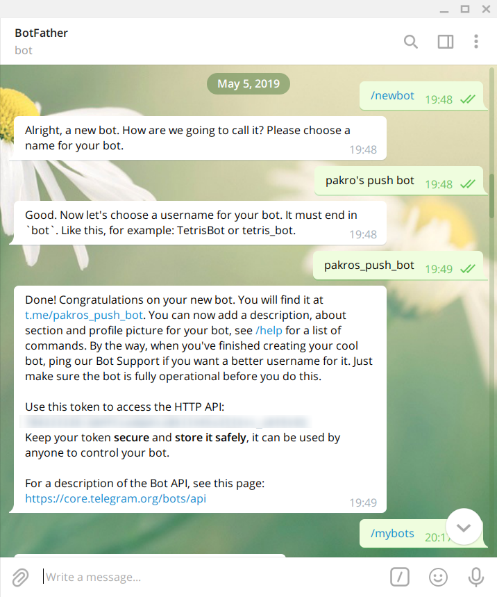
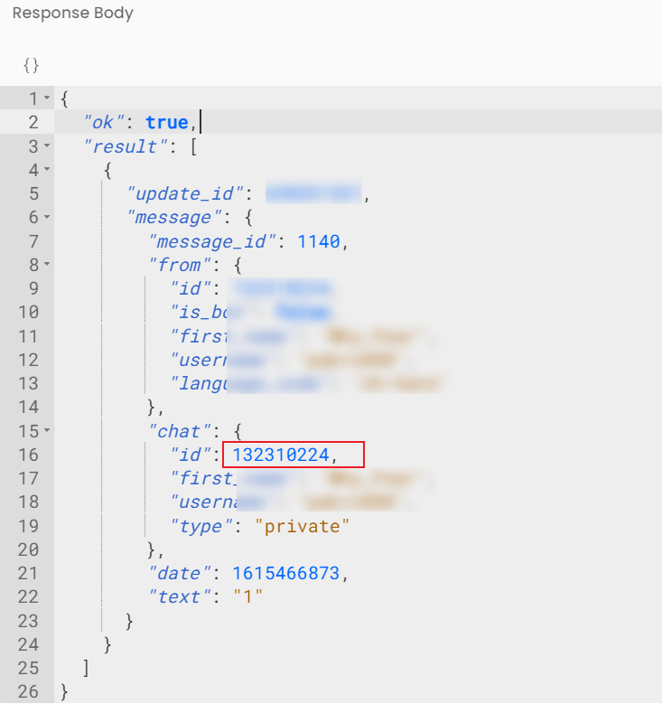
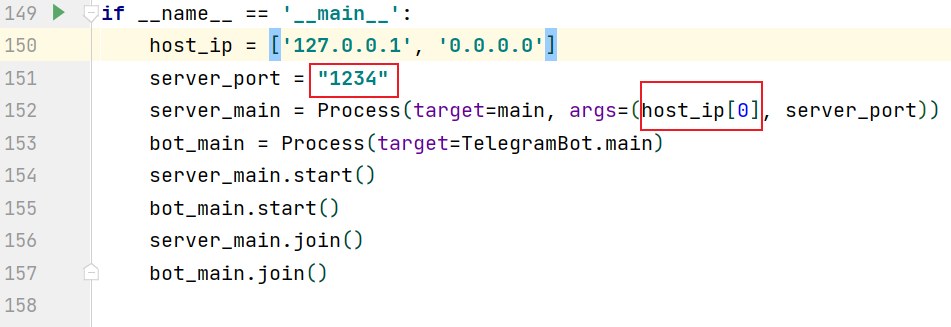
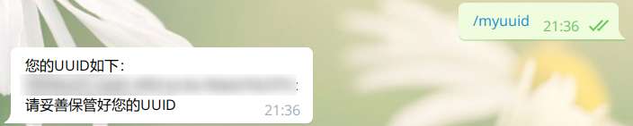
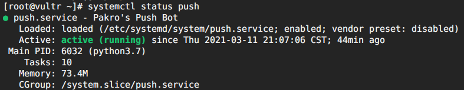

**本程序目的:** 实现像server酱那样的推送服务，支持telegram、微信。

# 使用方法
**具体使用方法正在编写中**

***因为注册模块是写在telegram里面的，所以目前不能脱离telegram运行，后期可能考虑将管理和注册模块移植到网页端。***

## 前置准备

1.  一台vps（必须）
2.  一个域名（没有也无所谓）
3.  postgresql数据库
4.  python3.6以上

## clone项目

```shell
# 首先clone项目
git clone https://github.com/WhyFear/PushBot
cd PushBot
# 安装必要的依赖包
pip install -r requirements.txt
```


## .env文件的配置

### 数据库的配置

首先需要配置数据库，因为我常用数据库是postgresql，所以目前只支持postgresql，~~虽然添加其他数据库就几行代码的事~~

推荐使用docker安装数据库，简单易上手，可以参考我的[这个文章](https://blog.pakro.top/2020/my_docker_command/#postgres)。

将.env_template文件名更改为.env并填充完**#数据库**以下的信息

### telegram机器人的申请

1.  首先需要有一个telegram账号，然后关注[@BotFather](https://t.me/BotFather) 
2.  输入或者点击/newbot
3.  这时候会让你输入你的bot名字，类似我们展示出来的名字，比如我输入了pakro's push bot
4.  上一步输入后会让你继续输入bot的用户名，类似我们的登录名，必须以bot结尾，比如我输入了pakros_push_bot
5.  botfather会给你一个TOKEN，这个TOKEN非常重要，不能泄露出去。
6.  将获取到的TOKEN填写到.env文件的TELEGRAM_BOT_TOKEN一项中去。

>   
>
>   申请流程如上图，TOKEN已打码

7.  点击 t.me/pakros_push_bot 链接关注自己的机器人。

8.  随便发送一条消息。

9.  浏览器中打开 https://api.telegram.org/bot#TOKEN#/getUpdates ，将#TOKEN#替换为刚才获取到的TOKEN（bot不要删了）

10.  将红框内的id填写入.env文件的TELEGRAM_CHAT_ID一项中。

     >   

到此，telegram的内容就设置完毕了。

### 企业微信的设置

**这里的操作是复制的server酱的说明**

1.  用电脑打开[企业微信官网](https://work.weixin.qq.com/)，注册一个企业
2.  注册成功后，点「管理企业」进入管理界面，选择「应用管理」 → 「自建」 → 「创建应用」
3.  应用名称随便填写，可见范围选择公司名。
4.  创建完成后进入应用详情页，可以得到应用ID( agentid )，应用Secret( secret )，复制并分别填到.env文件中的WECOM_AGENTID、WECOM_SECRET。
5.  进入「[我的企业](https://work.weixin.qq.com/wework_admin/frame#profile)」页面，拉到最下边，可以看到企业ID，复制并填到.env文件中的WECOM_COMPANYID。推送UID直接填@all ，推送给公司全员。
6.  进入「我的企业」 → 「[微信插件](https://work.weixin.qq.com/wework_admin/frame#profile/wxPlugin)」，拉到下边扫描二维码，关注以后即可收到推送的消息。

填写完三个key后，企业微信推送的设置也完成了。


### UUID的设置

随便搜索一个uuid的生成网站生成一个UUID即可，然后将生成的UUID填写到.env文件的MY_UUID一项中。

到此，.env的配置就完成了，下面是服务器的配置。

## 服务器的配置

### 数据库的初始化

在PushBot文件下执行，python的安装方法可以参考我的[这篇文章](https://blog.pakro.top/2020/centos7_install_python3/)：

```shell
python3 PushDatabase.py
```

此时程序会自动初始化数据库并且添加你的个人信息进去，如果终端显示处理完成，那么说明数据库初始化成功，可以进行下一步了。

### 服务的启动

如果需要对启动参数进行修改，请打开MyServerJiang.py这个文件，拉到最底下。

两处红框处均可以修改

-   如果想要修改端口号，**改动1234**即可

-   如果没有前置代理（比如nginx或者caddy），需要直接运行的，可以将**[0]改为[1]**，这样程序就会监听所有ip地址，但是我不建议这样做，因为有暴露的风险。

>   

如果使用caddy作为前置代理，可以参考我的配置：

```shell
https://your.website.name {
  gzip
  tls ***@***.com
  proxy / localhost:1234 {
    websocket
    header_upstream -Origin
  }
}
```

### 测试启动是否正常

执行下面的命令，测试启动是否正常。

```shell
python3 MyServerJiang.py
```

如果没有报错，那么有以下几种测试方法。

1.  在telegram机器人聊天界面输入/myuuid，查看是否回复

    >   

3.  浏览器中输入：https://yourip/?UUID={UUID}&text={HELLO}&desp={WORLD} 

    将UUID改为你自己的UUID，查看telegram和微信是否能接收到消息，并且浏览器也会显示{"status":true}。

    >   
    >
    >   

### 注册为服务

如果没有问题，那么可以将PushBot注册为服务了

首先要记录两个信息

1.  

```shell
# 在PushBot文件夹中输入如下命令
pwd

# 如
[root@vps PushBot]# pwd
/root/PushBot
```

2.  

```shell
# 输入如下命令找到python安装位置
which python3

# 如
[root@vultr ~]# which python3
/usr/local/python3/bin/python3
```

​    将上面两个结果记录下来。


```shell
nano /etc/systemd/system/push.service
```

修改下面的ExecStart一行的下面两个参数
/usr/local/python3/bin/python3.7 
/root/PushBot/

```shell
[Unit]
Description=Push Bot
After=network.target

[Service]
Type=simple
Restart=always
RestartSec=1
User=root
ExecStart=/usr/local/python3/bin/python3.7 /root/PushBot/MyServerJiang.py

[Install]
WantedBy=multi-user.target
```

保存退出

```
systemctl daemon-reload
systemctl start push
# 查看运行状态
systemctl status push
# 如果运行状态是运行中
systemctl enable push
```

>   

到此，所有设置完毕，可以开始使用了。